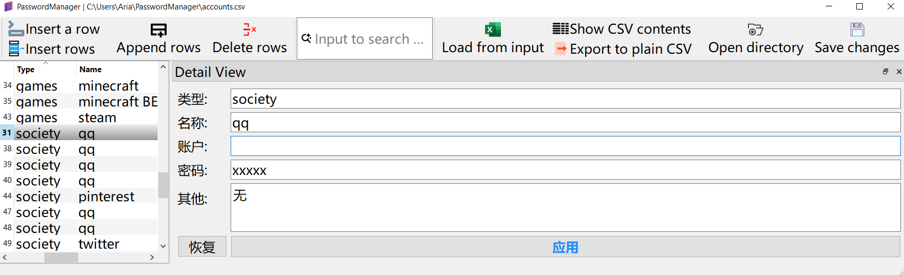

# PasswordManager

## 免责声明
本软件仅供个人非商业用途使用。开发者不对软件的安全性、稳定性、适用性作任何明示或默示的保证。

用户在使用本软件时，应自行承担相关风险。因使用不当、误操作、数据丢失或其他原因导致的直接或间接损失，开发者概不负责。

禁止将本软件用于非法用途，否则一切后果由使用者自行承担。

​继续使用即表示您已阅读并同意本声明。​


## 功能简介




支持AES/GCM加密算法的密码本. 初次打开时, 请选自"源自明文", 并设定好密钥, 此时可以新增/删除/编辑记录, Ctrl+S保存后就会生成accounts.csv文件(已加密);

下次打开时, 选择"源自密文", 并输入已经设定好的密钥, 即可查看所有密钥;

若需要备份, 

    可以选择导出明文文件(不建议) => plainAccounts.csv文件, 

    也可以保存密文文件(建议) => accounts.csv文件

若需要导入, 则需要把.csv文件放入build/XXXX路径下

### 依赖 OpenSSL
​下载 Win64 OpenSSL v3.5.1（非 Light 版本）​​ https://slproweb.com/products/Win32OpenSSL.html

访问 OpenSSL 官方下载页面

选择 ​Win64 OpenSSL v3.5.1​（不是 Light 版本）

下载并运行安装程序 Win64OpenSSL-3_5_1.msi 280MiB
​
安装 OpenSSL​

安装路径默认为C:\Program Files\OpenSSL-Win64（便于管理）
​
勾选 "Copy OpenSSL DLLs to The OpenSSL binaries (/bin) directory"​​
 
安装好后, 在命令提示符窗口下执行如下代码, 有输出版本则说明安装成功
```bash
C:\Users\Aria>cd C:\Program Files\OpenSSL-Win64\bin
C:\Program Files\OpenSSL-Win64\bin>openssl version
OpenSSL 3.5.1 1 Jul 2025 (Library: OpenSSL 3.5.1 1 Jul 2025)
```

`C:\Program Files\OpenSSL-Win64\lib\VC\x64`下的四个路径分别是

1. MD动态发布
2. MDd 动态调试
3. MT静态发布
4. MTd 静态调试


在.pro中需要加入如下代码
```pro
win32 {
INCLUDEPATH += "C:/Program Files/OpenSSL-Win64/include"
LIBS += -L"C:/Program Files/OpenSSL-Win64/lib"

# 根据 Release/Debug 选择不同的 .lib
CONFIG(debug, debug|release) {
    # Debug 模式 → 使用 MDd
    LIBS += "C:/Program Files/OpenSSL-Win64/lib/VC/x64/MDd/libssl.lib"
    LIBS += "C:/Program Files/OpenSSL-Win64/lib/VC/x64/MDd/libcrypto.lib"
} else {
    # Release 模式 → 使用 MD
    LIBS += "C:/Program Files/OpenSSL-Win64/lib/VC/x64/MD/libssl.lib"
    LIBS += "C:/Program Files/OpenSSL-Win64/lib/VC/x64/MD/libcrypto.lib"
}
```

在CMakeLists.txt中需要加入如下代码
```txt
# OpenSSL configuration for Windows
if(WIN32)
    # Set OpenSSL paths
    set(OPENSSL_ROOT_DIR "C:/Program Files/OpenSSL-Win64")

    # Include directories
    include_directories("${OPENSSL_ROOT_DIR}/include")

    # Library paths
    link_directories("${OPENSSL_ROOT_DIR}/lib")
    link_directories("${OPENSSL_ROOT_DIR}/lib/VC/x64")

    # Debug vs Release library selection
    if(CMAKE_BUILD_TYPE STREQUAL "Debug")
        target_link_libraries(PasswordManager PRIVATE
            "${OPENSSL_ROOT_DIR}/lib/VC/x64/MDd/libssl.lib"
            "${OPENSSL_ROOT_DIR}/lib/VC/x64/MDd/libcrypto.lib"
        )
        message(STATUS "Linking with OpenSSL Debug libraries")
    else()
        target_link_libraries(PasswordManager PRIVATE
            "${OPENSSL_ROOT_DIR}/lib/VC/x64/MD/libssl.lib"
            "${OPENSSL_ROOT_DIR}/lib/VC/x64/MD/libcrypto.lib"
        )
        message(STATUS "Linking with OpenSSL Release libraries")
    endif()
endif()
```


### 导出
可导出记录到明文csv文件, 可保存记录到密文csv文件;

### 导入
可从密文CSV文件导入, 可从明文CSV文件导入;


### 代码结构

SimpleAES.h 加密/解密

AccountStorage.h

    字符串反序列化成结构体
    结构体序列化成字符串

AccountListView.h
    细节预览界面

AccountDetailView.h
    中心界面

PwdTableModel.h
    排序/过滤/模型

main.cpp

PasswordManager.h